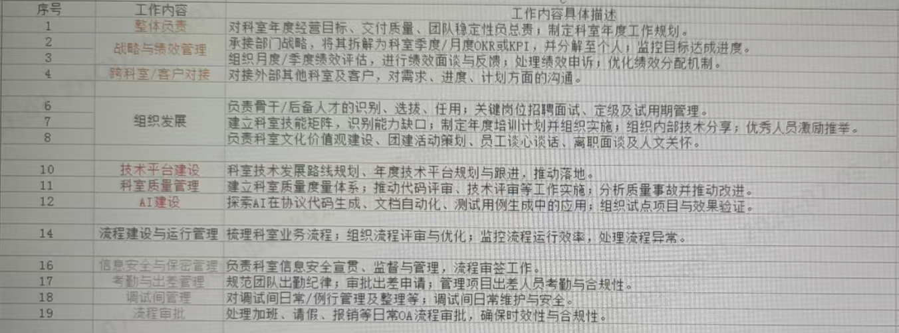

# mgr

> 来源：`mgr.docx`。本文由 docx 自动提取为 Markdown，用作本项目背景知识。

## 20260529

### 团队管理

1. 理清SE组成员、主任设计师、团队带头人的职责边界在哪里？

1. 作为链路层团队负责人，链路层团队主要负责的工作：民品系列，多个项目的交付落地，很多新增功能特性：无中心、分层分簇、空分复用、分裂融合、1Gbps等交付压力很大；内部平台建设，代码需要模块化重构，CBB建设，自测试能力建设，否则扛不住这么多特性落地，且不利于多人协作；团队成员能力层次不齐，需要梯队培养。

1. 学习了基层管理知识，有如下想法：

1. 周会、日会策划和驱动

1. 每周任务规划，更新任务看榜，管理任何和项目任务，定人定事定时间

1. 开周会：改为抄送周报给我（总结上周工作+规划下周工作），或群里上报

1. 开站会：改为自行主动沟通，风险上报资源申请，每日更改项目早会，在群里发布问题分配和新增需求。

1. 走动管理：随时问题沟通、技术讨论

1. 链路层行为准则：1）工作汇报+风险上报2）KB方案记录+自测试子路3）评审记录+闭环。

1. 人员培养：湘湘（毕业3-4年，骨干、挑战）任霜（34岁，主动性需要提升，希望尊重、认可）泰利（36岁，能力有待提升，希望胜任工作、合格）符兵（刚毕业1年，刚转入链路层团队，希望成长）

1. 泰利/符兵的培养，识别工作中具体的问题，需要什么态度，采用什么培养计划

1. 1）定位目标职责，有哪些不满意的地方，定培养计划

1. 2）动作分类：知识学习、实践性学习、导师带教

1. 3）具体的动作

1. 建立AB角机制，湘湘和泰利一组，做链路层组网方向，任霜和符兵一组做链路层资源方向。湘湘做任务拆解，给泰利小一点的模块，提升泰利的能力；符兵向任霜学习资源方面，并跟着做一些小的功能，以备任霜9月份修产假。A角（湘湘，任霜）负责B角的赋能，把关B角的输出，降低项目风险；B角做A角的支撑，分担琐碎性的事情。

1. 如何明确AB角的具体要求？结合A角带教B 角的需求，促进B角能力提升。

1. 质量控制：

1. 没有需求或需求不清晰：向上要求需求任务书，会议讨论达成一致（主动向上拱）

1. 设计错误：需规、概设、代码、自测试用例、自测试报告平时

1. 进度风险：人员安排不当（阶段检查）集成延迟（集成计划+关键点把控）

1. 带团队：领导带头、骨干带动、群众发动，机制建设，团队文化建设

1. 不同的领导方式：指令（低能力，刚进来）教练（中能力）支持（意愿不强）授权（高能搞态度）

## 20260530

### AB角机制

这个问题问的是怎么实际落地执行，我结合你之前描述的团队情况（湘湘、任霜、泰利、符兵四人）拆解一下：

第一步：定框架（第1周）

开一个小会，把AB角分组和逻辑讲清楚：

- 湘湘 + 泰利 → 链路层组网方向

- 任霜 + 符兵 → 链路层资源方向

明确说清楚：A角不是"甩任务给B角"，而是负责带教和把关；B角不是打杂，而是承接真实工作、为A角分担。这个定性很重要，否则容易变成A角不愿带、B角觉得被利用。

第二步：定具体要求（第1-2周）

A角对B角的带教，要落到纸面，不能模糊：

|  | 湘湘带泰利 | 任霜带符兵 |
| --- | --- | --- |
| 教什么 | 组网方向的模块设计、任务拆解方法 | 资源方向的业务逻辑、开发规范 |
| 怎么教 | 湘湘做任务拆解时，拉上泰利一起讨论，给泰利分配小模块独立承接 | 符兵跟做一个小功能，任霜代码评审+讲解 |
| 怎么验收 | 泰利的模块输出，湘湘把关后提交，你抽查 | 符兵的功能交付，任霜签字确认质量 |

第三步：差异化启动（重点）

四个人的情况不一样，启动方式要分开：

- 湘湘：单独谈，给她"骨干带动"的定位感，让她感受到这是信任和成长机会，而不是额外负担。她需要的是认同感驱动。

- 任霜：强调"符兵是来帮你分担的"，9月产假前把东西交出去，她能放心休假。把AB角包装成对她有利的事。

- 泰利：用指令式启动，先给他一个明确的小任务，不要让他自己摸索，降低挫败感，做完一个给正向反馈，逐步建立信心。

- 符兵：刚入团队，正是最有学习意愿的时候，明确告诉他跟任霜学什么、学到什么程度，给他一个清晰的成长路径。

第四步：建检查节点

AB角机制最容易烂尾，需要你定期盯：

- 每两周：在走动管理时顺带问一下带教进展，不用开专项会

- 每月：在周会上让A角简单汇报一下B角的进展和问题

- 阶段里程碑：泰利独立完成第一个模块、符兵独立承接第一个功能，这两个节点要明确庆祝一下，强化正向信号

一个常见坑要提前规避

A角往往会"觉得自己做更快、不愿意教"。你需要在考核/绩效上体现带教的价值，哪怕只是口头上的认可，也要让湘湘和任霜感受到"带好B角"是她们工作成果的一部分，而不是额外的负担。

### 时间管理

先把问题说透，再给解法。

#### 根本矛盾是什么？

你现在的状态是：五重职责叠加，但没有做时间分层。

从4、5月工作记录来看，你的时间实际上被三类事情吃掉了：

- 救火类：外场问题（飞参、机转发目标）、CRC问题、TCP优化、MAC频繁挂死定位……

- 评审类：需求评审、方案评审、总体设计讨论，16天里光1320就累计了

- 协调类：与其他科室拉通、接口对齐、组内置顶

架构设计和CBB，属于重要不紧急的事，在五重职责全压身上、天天有紧急事项的情况下，永远排不上去。这不是你不努力，是结构性问题。

#### 五重职责的本质冲突

你在图3里问的那个问题，其实已经把答案说出来了：

主任设计师+链路层导师的职责杂在一起，进度+质量+培养全压你身上

可以这样理解三者的冲突：

| 职责 | 时间特征 | 和架构/CBB的冲突 |
| --- | --- | --- |
| SE组成员 | 需求驱动，评审密集 | 直接抢时间 |
| 主任设计师 | 进度跟进，天天有事 | 打碎时间，无法深度思考 |
| 链路层导师 | 质量把关+带人，随时被打断 | 碎片化，架构需要连续时间 |
| 架构/CBB | 需要整块时间，无紧急压力 | 永远被前三者挤掉 |
| DMAC开发 | 实际交付任务 | 直接挤压 |

#### 解法：三件事同时做

##### ① 先把职责边界理清楚（向上解决）

你在图3里说"两个职责扣在一起，进度+质量的责任都扣我身上"——这个问题不解决，后面都是空谈。

建议你和王总/刘总明确提出：

- 主任设计师的进度跟进，能否让湘湘承担日常跟进，你只做关键节点介入？

- 链路层导师的质量把关，能否建立"A角把关B角输出"的机制（你已经设计了AB角），让你从逐条评审变成抽查？

这不是甩锅，是把你从执行层解放出来，做只有你能做的事。

##### ② 给架构/CBB划出"保护时间"

从你的工作记录看，每天都是碎片化任务。架构设计需要的是连续2小时以上的深度时间，不能靠"有空了再做"。

具体做法：

- 每周固定2个半天（比如周二上午、周四上午）作为架构时间，这两个半天不排评审、不接临时需求

- 在团队里公开这个安排，让成员知道这个时间段找你要走AB角流程，不能直接打断

- 如果评审实在绕不开，提前一周排进去，不做临时插入

##### ③ 把CBB建设拆成可交付的小任务，交出去

CBB建设迟迟推不动，还有一个原因是：这件事在你脑子里，没有被拆解成别人能接手的颗粒度。

建议：

- 你花一个架构时间，把CBB建设拆成5-10个独立模块

- 把其中不需要你亲自做的模块，交给湘湘或任霜承接（结合AB角机制）

- 你只负责定方向、评审输出，不亲自写

这样CBB建设就从"你一个人的事"变成"团队的事"，推进速度反而更快。

#### 一句话总结

你现在缺的不是时间，是对自己时间的控制权。解法是：向上理清职责边界，减少你在进度跟进和日常评审上的直接投入；同时给架构时间上锁，把CBB颗粒化之后交出去做。

### 分析&决策

分析：

活太杂了，分出去。

所有进度、质量、带教的活都在我身上，我自己的事还要我自己测，没有人协助。

A角也不能太好过日子了，只要负责自己的工作，还有B角协助。

SE组成员，总体设计，不分，需求讨论，带上A/B角一起讨论，主动向上拱。

主任工程师：进度跟进，分出去

导师：评审&带教，采用AB角，分出去

决策：

1. 进度跟进，1320V2.0早会，改成4个人轮流参加。

1. 建立A/B角机制

1. A角负责带教和把关，将一些重复性活分出去

1. B角承担真实工作，并快速学习。

1. 评审后续，控制在只做一次方案评审+一次代码评审。

## 20260616

### 自我管理与工作分派

#### 第 1 题（20 学分）

结合你近期担任组长的情况，写出你目前最需要改进的 1 个组长角色认知偏差（请附上真实发生的例子）；针对这个偏差，制定 2~3 个具体的改进动作，要求可执行，可检查；最后，你打算如何检查自己是否真的改进了？

偏差：习惯性亲力亲为，不懂合理授权，习惯性自己兜底，没有充分发挥组员能力，既导致自身精力被大量消耗，也压抑了组员的成长空间。

例子：2026年3月~5月，1320项目每日早会，包括周六早会，都是我本人参加，并在会后将早会中的工作任务、问题、相关注意事项转发给组员，独立承担了所有与项目管理汇报、跟进、技术需求澄清和技术接口对接工作。

改进动作1：组内4人（除去怀孕的同事），加上我，共4人，按周轮值去参加1320项目早会（我额外固定周一的时候参加，了解项目全盘进展），根据组员当前要交付的工作情况，每周委派一个组员参加，并负责对接本组相关工作任务、问题和注意事项。

比如第一周，组员A有重点任务交付，即派他第一周参加早会，直观感受项目组交付压力，及时协调资源需求（设备），及时对接协作模块开发进展和联试情况。

改进动作2：AB角机制落地，将组内现有的组网/资源两个方向的成员配对，A角负责带教和把关，将一些重复性活分出去，B角承担真实工作，并快速学习。

检查方式：每月周报、月报中，用于项目管理、评审&帮助的工时占比显著减少。

#### 第 2 题（25 学分）

列举 1 个你近期准备开展的工作分派任务，请以结构化思维阐述你在工作分派中的思考和过程，同时识别该任务中 1~2 项关键活动或里程碑计划，你想如何通过过程管理达成结果？

任务名称：定向链路层自验证体系建设与落地

近期我准备分派并推进“定向链路层自验证工作”。该任务的核心目标是：在重点交付项目进入集成前，确保链路层软件已完成规范、完整、可追溯的科室级自验证，降低集成阶段缺陷外溢，提升交付质量。

一、工作分派思考与过程

我会先按“目标-范围-责任-交付物-检查机制”的思路拆解任务。

1. 明确目标与范围

聚焦链路层软件在项目集成前的自验证活动，重点解决当前自验证标准不统一、报告格式不一致、准入准出条件不清晰、责任边界不明确等问题。

2. 拆解工作包

将任务拆成四类工作：

◦ 自验证规范编制：明确准入条件、准出条件、执行步骤、问题闭环要求。

◦ 角色责任定义：明确模块负责人、主任设计师、XQA的职责边界。

◦ 报告模板建设：统一自验证报告结构，包括验证范围、版本信息、用例结果、遗留问题、风险评估、结论等。

◦ 试点与优化：选择重点交付项目先行试用，根据反馈修订规范和模板。

3. 责任分派

指定一名主责人牵头规范编制，安排各链路层模块负责人补充模块级验证要求，同时由主任、SE、XQA和集成测试组参与评审，确保规范不仅“写得完整”，也能在项目中真正执行。

4. 交付物管理

《链路层软件自验证规范》

《链路层自验证报告模板》

试点项目自验证报告

问题清单与闭环记录

二、关键活动或里程碑计划

1. 里程碑一：完成自验证规范和报告模板评审发布

计划先完成初稿编制，再组织主任、SE、XQA和集成测试组评审，重点确认准入准出标准、责任角色、报告字段是否可执行。评审通过后形成科室统一版本。

2. 里程碑二：完成重点项目试点并闭环优化

选择一个重点交付项目作为试点，要求其在集成前按规范完成自验证并输出报告。试点结束后复盘问题，例如模板是否冗余、准出条件是否清晰、问题闭环是否可追踪，并完成版本优化。

三、通过过程管理达成结果

我会采用“节点管控+问题闭环+质量度量”的方式推进。每个项目进入集成前，必须检查自验证报告是否齐套、准出条件是否满足、遗留问题是否评估并闭环。过程中建立问题台账，按责任人、计划关闭时间和风险等级跟踪，避免自验证流于形式。

最终希望形成一个可复用的科室级机制，让链路层软件在交付前做到“有标准可依、有过程可查、有结论可判、有问题可追”，从而减少集成阶段返工，提升重点项目交付质量。

#### 第 3 题（15 学分）

假如你的组员 A 和 B 在某项目技术方案中，发生严重技术分歧，两人各不相让，已经争执两天了，影响了项目的进度。如果你必须今天做出决定，你会采取哪些具体步骤来处理这个冲突（列出具体步骤）？决定做出后，你会如何安抚未被采纳的一方，请写出你打算对他说的话

具体步骤：

1. 先听，找组员A和B，分别了解他们技术方案关键和细节。

1. 对比，基于核心思路/优势/风险/代价依赖条件4个维度，对两个方案进行评估。

1. 决策，对照项目当前核心约束（进度/可靠性/可维护）决策最佳方案，或融合方案A B，得到更优的方案C。

1. 开会，肯定A和B，宣布结果，说明决策依据，分工和安排（定人、事、时间）

1. 设置复盘节点，方案执行到某个里程碑后，做一次技术回顾，重新评估未被采纳的方案，如果有价值，可以在下个阶段实现。

1. 安抚（单独聊）：

1. "我想找你单独聊聊。

1. 今天的决定，不是说你的方案有问题。说实话，你提出的XXXX这个顾虑，我认为是对的，我在最终方案里也要求对方把这一点纳入进来。

1. 我做这个选择，主要是因为当前阶段我们的进度压力非常大，在这个前提下，A的方案代价更小。你的技术能力我是非常认可的，只是时机和条件现在不具备。

1. 接下来，我想请你担任这个方案的风险评审和把关，你的技术思路可以很好地帮我们规避潜在漏洞。后续我们可以把你的方案整理归档，用到下一期架构迭代项目中。有什么想法，随时来找我。"

#### 第 4 题（25 学分）

你们小组共 5 人，当前任务状态如下： 张三（4 级工程师）：负责核心模块 A，进度正常，但已经连续加班两周； 李四（3 级工程师）：负责模块 B，出现技术卡点，已阻塞两天； 王五（2 级工程师）：负责模块 C，基本完成，但完成质量一般，还需要更多检查； 赵六（1 级工程师）：刚转正，正在熟悉业务，任务较轻； 你自己（组长）：既要参与技术决策，也要负责整体协调。

今天科室主任紧急插入一个新任务：开发一个小型数据核对工具，要求 3 天内完成，复杂度中等，不涉及核心业务改动，但需要独立设计一个简单的前端页面 + 后端接口。 a) 你会把这个任务指派给哪一位或哪几位组员？请说明分配理由。 b) 分配后，你如何同步信息？请写出你发给对应组员的消息原文（或关键要点）。 c) 为避免影响原有任务，你会采取哪些协调措施？

1. 任务指派给“赵六”，王五辅助代码审查，并由我指导/把关。原因：张三李四压力大有卡点，王五需要做大量检查和验证工作，只有赵六任务较轻，复杂度中等，不涉及核心业务改动适合练手。

1. 赵六，主任今天插入了一个紧急任务，我想交给你来主导，跟你说一下。

1. 任务内容：开发一个小型数据核对工具，包含一个简单的前端页面和后端接口，不涉及核心业务改动。

1. 截止时间： 3天内完成（×月×日下班前）。

1. 工作大致安排：

1. • 今天下班前，把你理解的需求和大致的设计思路发给我，我来确认方向对不对；

1. • 第一天方案设计，写完发我确认一下；

1. • 第二天代码开发，找王五做代码Review，我已经跟他说好；

1. • 第三天测试验证，测试用例提前发我看一下，遇到卡点随时来找我；

1. 你现在任务空间最大，而且这个工具是个一个很好的机会。有问题随时找我。

1. 同步王五：

1. 王五，模块C的自查继续推进。另外赵六在做一个3天的数据核对工具，我希望你帮他做过程中的代码 Review，主要把把质量关就行，不需要你写代码。

1. 协调措施

1. ① 保护张三和李四不受干扰

1. • 今天组会/群里明确说明：此任务由赵六负责，其他人无需介入，李四专注解卡点。

1. ② 给赵六设立"每日一同步"节奏

1. • 每天10分钟站会式对齐：今天做了什么、明天做什么、有没有卡点。

1. • 目的：3天任务不能等到第3天才发现方向错了。

1. ③ 我自己的介入边界

1. • 第1天：确认需求理解+方案方向

1. • 第2天：委派王五负责代码review，我只负责关键问题，有问题及时纠偏

1. • 第3天：验收+交付

1. • 不做具体编码，防止又回到"亲自上手"的老问题

1. ④ 提前和主任对齐一次

1. • 确认3天交付的验收标准是什么，避免最后一天出现理解偏差。

#### 第 5 题（15 学分）

你们组接到一个 “不可能任务”，正常需要 2 个月，现在要求你 15 天完成。如果允许你打破常规，但不能增加人手，也不能降低质量底线。你会颠覆和改变工作分派的哪些常规做法？请列出至少 3 条，并说出你的理由。

1. 策略一：废除串行评审门控，改为并发+接口契约制

1. 传统流程每个阶段都有评审，下一阶段必须等上一阶段完全通过才能启动。

1. 打破方法：第一天锁定模块接口（函数签名、数据结构、帧格式），各子模块并行开发，测试人员同步编写用例。不等设计完成才编码，不等编码完成才测试。

1. 策略二：取消固定职责分工，针对关键路径，实行人员动态调整

1. 常规做法：A负责调度，B负责收包，C负责测试，职责清晰但形成孤岛。

1. 打破方法：每天晚上识别明日关键路径的阻塞点，次日早上将1-2人从非关键任务临时抽调过来支援。人跟瓶颈走，不跟模块走。

1. 策略三：废除"完整方案评审前置"，改为最小可验证原型驱动

1. 常规做法：详细设计文档评审通过后才允许写一行代码，往往耗掉两周。

1. 打破方法：48h 内跑通最核心的一条链路（最小模型），用可运行的原型替代纸面方案来驱动讨论和决策，减少"想象中的设计争议"。

## 20260702

### 角色转变

#### 问题1：升级副主任的窗口期，重新建立规则

1. 1320V2.0主任工程师，转给肖湘湘，或以肖湘湘为主

1. 早会我不再参加，由湘湘主管，即进度管理转湘湘。

1. 需求协调，由特性负责人负责，各方向负责人对外，我只做最终裁定。

1. （科室的职责是把选项和代价摆清楚，逼决策者做决策，而不是替他们找答案。）

1. 其实，我今天的需求协调，是给任霜干活，她还朝我冲，真是失败。承担了别人的职责，给别人当枪使，还吃力不讨好。

1. 缺陷管理和问题跟踪，由湘湘XQA负责

1. 需要跟人battle，当事人先打，我只压阵，他们先表述，我再补充。

转交湘湘的具体动作

找湘湘单独谈15分钟，明确三点：①她来主导定向链路层方向日常拉通；②遇到搞不定的你压阵，但她先上；③下周早会开始她来跟

下次有人找你确认组网方向的事，只说一句：「这个找湘湘。」不解释，不补充

1. 我去做副主任，拔高一级，迎接更大的调整，你也需要从模块负责人，变成定向链路层方向负责人；了解定向链路层三个方向，任霜离职后，你能紧急补位。

1. 作为主任工程师后，不仅仅代表组网方向，也代表整个链路层。

1. 1320的早会跟进，由你安排；

1. 方案、评审、自测试跟踪，也由你负责，你本来就是XQA；

1. 缺陷管理和问题跟踪，也属于质量管理，可以提到加分项中。正好一举两得，既管了链路层主任设计师，又管了XQA。

#### 问题2：我作为副主任的应对之策

1. 我和底下员工之间的职责清晰化

1. 在职责范围内：

1. • 技术方向把关：架构决策、CBB规划、重大方案评审

1. • 团队能力建设：梯队培养、AB角机制、技术规范制定

1. • 向上接口：代表团队参与跨部门重大技术决策

1. 不在职责范围内：

1. • 日常需求拉通和协调（主任设计师职责）

1. • 具体模块开发和问题定位（工程师职责）

1. • 早会主持和日常进度跟踪（轮值/项目负责人职责）

1. 我和汪洋的分工方式探讨。一会又说不要区分链路层网络层，一会又说你链路层的人要我网络层去沟通，双标。

1. 当前风险上报

1. 「任霜29周，预计9月中离岗，资源管理方向存在缺位风险，新员工来不及完全接手，建议提前做好预案——要么调配人力支援，要么明确该方向任霜离岗期间的需求优先级。」

1. 分工

1. 

明确负责(主导)

- 技术平台建设(10)、科室质量管理(11)、AI建设(12) — 主导设计与推进

- 流程建设(14) — 主导设计,运行阶段转交团队执行

按域负责(链路层范围内)

- 整体负责(1)、战略绩效分解(2)、绩效评估(3)、跨科室对接(4) — 限定链路层团队范围

- 组织发展(6-9) — 限定链路层团队范围

不负责(建议下放团队)

- 信息安全(16)、考勤出差(17)、调试间(18)、流程审批(19)

这个结构的好处是:技术类是你的核心战场,域内管理是你的合理边界,纯行政是双方共同甩掉的。

#### 问题3：科室人力盘点

1. 成员情况

1. 湘湘毕业3-4年，技术骨干能力强，需要被推到前面

1. 任霜29周孕期，预计9月中离岗希望被尊重认可，说话直接冲

1. 泰利36岁，能力待提升希望胜任工作，需要指令式带教

1. 符兵毕业1年，已学自适应未系统学习资源管理，成长意愿强

1. 新员工7月入职需入职培训，可培养方向待定

1. 刘平

1. 钟康

1. AB角分组与职责

1. 组网方向：湘湘（A）+ 泰利（B）

1. 湘湘：任务拆解、方向把关、带教泰利

1. 泰利：承接小模块，在湘湘把关下独立交付

1. 湘湘把关泰利输出后提交，你抽查

1. 资源方向：任霜（A）+ 符兵（B）

1. 任霜：带教符兵，沉淀资源管理文档

1. 符兵：跟做小功能，为任霜产假备份

1. 新员工：直接跟任霜学资源管理（7月起）

1. AB角落地步骤

1. 第一周：开小会，讲清楚AB角逻辑——A角负责带教和把关，B角承接真实工作分担琐碎

1. 第一至二周：落纸面，明确各组"教什么、怎么教、怎么验收"

1. 差异化启动（见人员培养策略章节）

1. 检查节点：每两周走动时顺带问进展；每月周会A角简报B角进展；重要里程碑正向强化

1. A角负责B角的代码评审、方案的带教和把关。

1. B角负责A角的测试、补缺位。

1. 数据处理方向

1. 当前：你亲自负责，无B角

1. 短期：将模块核心知识、历史踩坑、定位思路文档化

1. 中期：新员工熟悉后，承接日常维护（不要求能定位复杂问题）

1. 复杂问题定位：短期你仍需兜底，但目标从"脱不开身"变为"偶尔介入"

1. 成员 领导方式 具体做法

1. 湘湘 授权式 给定位感和信任，告知她是骨干带动的核心，让她感受到成长机会而非额外负担

1. 任霜 支持式+认可 强调"符兵是来帮你分担的"，把AB角包装成对她有利的事；群里给可见的认可

1. 泰利 指令式→教练式 先给明确小任务，做完给正向反馈，逐步建立信心，再过渡到教练

1. 符兵 教练式 明确告诉他跟任霜学什么、学到什么程度，给清晰成长路径

#### 问题4：关键风险与应对预案:

1. 风险一：任霜缺位（高优先级，时间确定）

1. 现状：任霜29周，约9月中旬离岗；新员工7月入职，扣培训后实际学习窗口只有6-8周，无法完全接手资源管理。

1. 应对方案：

1. 立刻执行——任霜开始输出文档

1. 每周固定输出资源管理核心知识、常见问题处理、当前版本的坑

1. 不要求完整，要求能用

1. 话术：「你的文档是团队资产，你休假前把这些留下来，也是对自己工作的交代。」

1. 任霜离岗后的分层预案：

1. 优先级 工作内容 谁来做

1. 一类（必须保障）线上紧急问题定位、版本发布关键验证 你兜底，或湘湘临时覆盖

1. 二类（新员工跟做）常规维护、非紧急问题跟进新员工做，你或湘湘把关

1. 三类（可延后）新特性开发、优化类需求向项目经理说明，提前延期

1. 现在就向上说（不要等到任霜离岗才暴露）：

1. 「任霜29周，预计9月中离岗，资源管理方向存在缺位风险，新员工来不及完全接手，建议提前做好预案——要么调配人力支援，要么明确该方向任霜离岗期间的需求优先级。」

1. 风险二：数据模块无B角

1. 短期无法靠培养解决，分两步走：

1. 知识显性化：模块架构、核心逻辑、历史踩坑、定位思路 → 文档化

1. 新员工稳定后，花部分时间学数据模块日常维护，目标是常规维护不用你亲自做

1. 风险上报原则

1. 你一个人扛不住，也不应该一个人扛。把风险量化清楚，提出来，让上级做决策——是调人、是降需求、还是接受风险，这是上级该做的事。

#### 问题5：我作为副主任的如何安身？

1. 旧角色VS新角色

1. 最强执行者，亲自解决问题 VS 团队放大器，让团队能解决问题

1. 问题的终点 VS 问题的路由器

1. 靠个人技术能力兜底 VS 靠规则、机制、人才培养兜底

1. 绩效=我解决了多少问题 VS 绩效=团队解决了多少问题

1. 绩效输出的三类

1. 第一类：技术决策

1. 重大方案的拍板、架构方向选择、跨模块技术取舍

1. 输出形式：决策文档，留记录

1. 第二类：规则和标准

1. CBB规范、代码模块化标准、自测试体系、知识库沉淀要求

1. 特点：做出来之后团队所有人受益，你走了依然存在

1. 第三类：团队能力

1. 湘湘能独立带方向、符兵能独立承接功能、新员工三个月能上手

1. 要记录，述职时说得出来

1. 链路层模块化、AI化

1. 自测试章程

1. 找一本管理的书看一下。

1. 找一本历史的书看一下。

#### 问题6：关于出差

1. 把自己该做的，该测试的，优先提前做好，避免要上前线测试、解决问题（尽量）。

1. 把自己做到无可替代，没有出差的理由。

1. 与网络层合作共赢，互相帮助，轮流来。

1. 如果无可避免还是出差了，那就把效果做到最大化，做成旗杆。

## 20260707

### 目标与过程管理

#### 第一题（10 学分）【管理实践 - 制定 | 修订目标】

请从管理的角度重新理解 SMART 原则，清晰的定义目标是提升团队执行力的前提条件。请阅读 SMART 原则要求，并以此设计组内相关业务的短期或长期目标，例如：某项目开发、技术难题攻关、小组承接的年度绩效考核 PBC 及组员个人成长计划等。

思考题：请认真运用 SMART 的表格，综合思考与设定小组的 3 个最重要的目标，目标设定的规范的目的不在于表述，而在于目标被准确的理解，这本身就是提升团队执行力的有效方法。

#### 第二题（25 学分）【管理实践 - 效能管理四象限】

基于「要事第一原则」和「效能管理四象限」知识点，结合自身小组的实际工作，运用四象限工具对日常工作事务进行分类分析，并制定改进计划。（包含以下 3 个小题）

1、概念理解：请用自己的话简要解释以下两个概念：（5 分）

①「重要性」—— 你个人觉得有价值且对你的工作、价值观及首要目标有意义的活动；

②「紧急性」—— 你或别人认为需要立刻处理的紧急事件或活动。

2、实务分析：请结合你所在小组的实际工作，完成以下四象限事务梳理：（10 分）

| 重要且不紧急（请列举 2-3 项） | 重要且紧急（请列举 2-3 项） |
| --- | --- |
| 123 | 123 |
| 不重要且不紧急（请列举 1-2 项） | 不重要但紧急（请列举 1-2 项） |
| 12 | 12 |

3、改进计划：针对第二题中你列出的「重要且不紧急」事务，请制定提前规划方案，以避免其转化为「重要且紧急」事务。（10 分）

①选择其中一项「重要且不紧急」事务，说明其如果未提前处理可能演变为「重要且紧急」的具体场景：

②你打算采取哪些具体措施来提前规划和推进该事务？

③你预期推进后，该事务对小组工作的改善效果是什么？

#### 第三题（15 学分）【管理实践 - 目标拆解】

请选择管理实践作业中的一个相关业务目标，将目标拆解每个周的具体工作，并将每个周的目标拆解成具体的工作任务（目标分析的核心不在于将大的目标分解为多个小目标，而在于将目标分解成多个任务）也就是说如果这些任务被有效地执行到位，那么目标将会被 100% 地实现。

1. 目标 拆解任务 优先级 负责人

#### 第四题（15 学分）【管理实践 - 为员工提供肯定型反馈】

平时注意员工的工作结果及行为，如果发现员工有好的结果及行为，可以使用肯定型反馈的方式，让员工知道你已经看到员工付出的努力及进步。请注意反馈的基本原则应用。

员工姓名：　　　　　日期：

| 情境｜任务描述： | 输入答案 |
| --- | --- |
| 员工行为表现 | 管理者的肯定 |
| 行为（A）： |  |
| 结果（R）： |  |
| 反馈心得笔记： |  |

#### 第五题（15 学分）【管理实践 - 为员工提供改善型反馈】

在检查工作的过程，发现员工的问题，并通过改善型反馈的方式为员工提供管理的意见，为每位员工提供一次反馈。请注意反馈的基本原则的应用。

员工姓名：　　　　　日期：

| 情境｜任务描述： | 输入答案 |
| --- | --- |
| 指出员工的问题 | 给出管理的建议 |
| 错误的行动（A）： |  |
| 不好的结果（R）： |  |
| 反馈心得笔记： |  |

#### 第六题（20 学分）【管理实践 - 重点工作检查】

检查是确保项目进度及保证业绩的重要方法，组长在跟组员就某任务目标达成一致后，可以通过定期的检查表来控制工作的进度，以确保任务的质量及效率。因此，组长需要以周为单位对重点项目及重点人群进行检查。请根据课上分享的工作检查表模板，在本次实践计划中，每完成一个的检查计划，您将获得 5 分，总共完成 4 个关键任务的检查，共计 20 分。（在检查节点的位置，写上检查的内容及检查方式）

| 序号 | 关键任务 | 负责人 | 检查节点（99%、50%、1%） | 处理方式 |
| --- | --- | --- | --- | --- |
| 1 |  |  |  |  |
| 2 |  |  |  |  |
| 3 |  |  |  |  |
| 4 |  |  |  |  |
| 5 |  |  |  |  |

